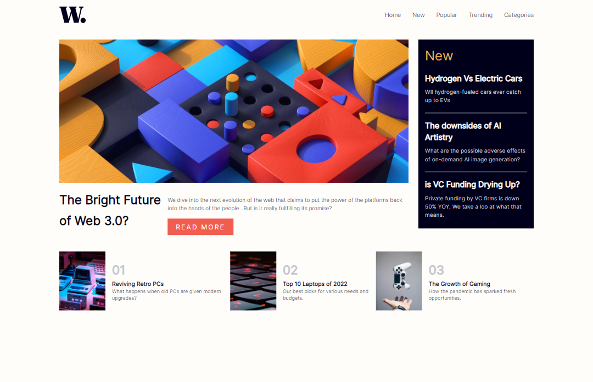

## Description

The News Homepage Challenge is a design challenge where participants are given a design for a news website's homepage and are asked to recreate it using HTML, CSS, and possibly JavaScript. For this particular submission, I used Next.js to build the application and Tailwind CSS to style the components.

## Screenshots

|  |  |
| ------------------------------ | ----------------------------- |
| Desktop version                | Mobile version                |

## Technologies Used

- Next.js
- React
- Tailwind CSS
- CSS Modules

## Installation

To run this project locally, follow these steps:

1. Clone the repository: `git clone https://github.com/hatemhenchir/news-homepage-challenge.git`
2. Change into the project directory: `cd news-homepage-challenge`
3. Install dependencies: `npm install`
4. Start the development server: `npm run dev`
5. Open `http://localhost:3000` in your web browser

